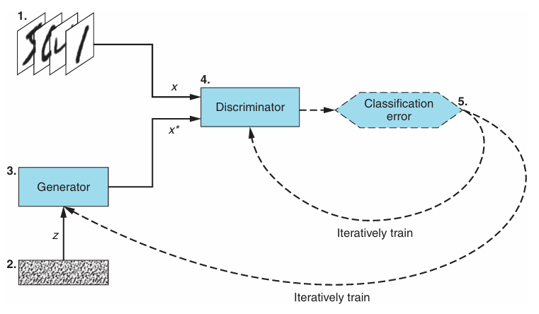
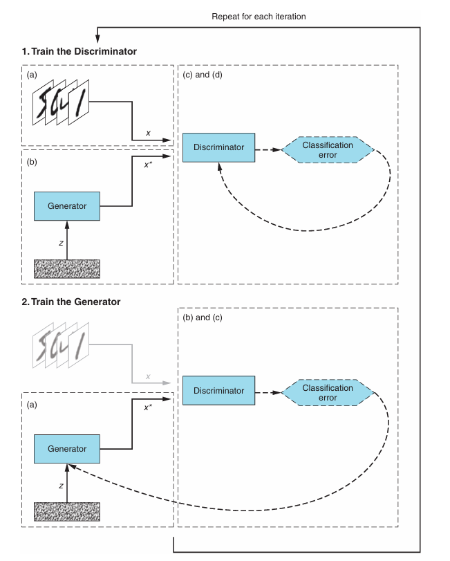

# GANs in Action

## 1 Introduction to GANs

### 1.1 What are Generative Adversarial Networks?

Generative Adversarial Networks (GAN) are a class of machine learning techniques that consist of two simultaneously trained models: one (the Generator) trained to generate fake data, and the other (the Discriminator) trained to discern the fake data from real examples.

The word generative indicates the overall purpose of the model: creating new data. The data that a GAN will learn to generate depends on the choice of the training set.

Finally, the word networks indicates the class of machine learning models most commonly used to represent the Generator and the Discriminator: neural networks. Depending on the complexity of the GAN implementation, these can range from simple feed-forward neural networks, to convolutional neural networks or even more complex variants, such as the U-Net.

### 1.2 How do GANs work?

Metaphorically, many real-word analogies can make GANs easier to understand: an art forger (the Generator) trying to fool an art expert (the Discriminator). The more convincing the fake paintings the forger makes, the better the art expert must be at determining their authenticity. This is true in the reverse situation as well: the better the art the expert is at telling whether a particular painting is genuine, the more the forger must improve to avoid being caught red-handed.

The Generator's goal is to produce examples that capture the characteristics of the trining dataset, so much so that the samples it generates look indistinguishable from the training data. It can be thought of as an object recognition model in reverse.

Object recognition algorithms learn the patterns in images to discern an image's content. Instead of recognizing the patterns, the Generator learns to create them essentially from scratch; indeed, the input into the Generator is often no more than a vector of random numbers.

The generator learns thought the feedback it receives from the Discriminator's classifications. The Discriminator's goal is to determine whether a particular example is real (coming from the training dataset) or fake (crated by Generator).

Accordingly, each time the Discriminator is fooled into classifying a fake image as real, the Generator knows it did something well. Conversely, each time the Discriminator correctly rejects a Generator-produced image as fake, the Generator receives the feedback that it needs to improve.

The Discriminator continues to improve as well. Like any classifier, it learns from how far its predictions are from the true labels (real or fake). So, as the Generator gets better at producing realistic-looking data, the Discriminator gets better at telling fake data from the real, and both networks continue to improve simultaneously.

|        |Generator      |Discriminator    |
|:------:|:-------------:|:---------------:|
|Input   |A vector of random numbers|The discriminator receives input from two sources: real examples coming from the training dataset; fake examples coming from the Generator;|
|Output  |Fake examples that strive to be as convincing as possible|Predicted probability that the input example is real|
|Goal    |Generate fake data that is indistinguishable from members of the training dataset| Distinguish between the fake examples coming from the Generator and the real examples coming from the training dataset|

### 1.3 GANs in action

GAN's algorithm to produce realistic-looking handwritten digits:

1. Training dataset: the dataset of real examples that we want the Generator to learn to emulate with near-perfect quality. In this case, the dataset consists of images of handwritten digits. This dataset servers as input (x) to the Discriminator network;
2. Random noise vector: the raw input (z) to the Generator network. This input is a vector of random numbers that the Generator uses as a starting point for synthesizing fake examples;
3. Generator network: the Generator takes in a vector of random numbers (z) as input and outputs fake examples (x*). Its goal is to make the fake examples it produces indistinguishable from the real examples in the training dataset;
4. Discriminator network: the Discriminator takes as input either a real example (x) coming from the training set or a fake example (x*) produced by the Generator. For each example, the Discriminator determines and outputs the probability of whether the example is real;
5. Iterative training/tuning: for each of the Discriminator's predictions, we determine how good it is-much as we would for a regular classifier-and use the results to iteratively tune the Discriminator and the Generator networks through backpropagation:
   1. the Discriminator`s weights and biases are updated to maximize its classification accuracy (maximizing the probability of correct prediction: x as real and x* as fake);
   2. the Generator's weights and biases are updated to maximize the probability that the Discriminator misclassifies x* real.

#### 1.3.1 GAN training

GAN training algorithm

* For each training iteration do
    1. Train the Discriminator:
        a. Take a random real sample x from the training dataset.
        b. Get a new random noise vector z and, using the Generator network, synthesize a fake example x*;
        c. Use the Discriminator network to classify x and x*;
        d. Compute the classification errors and backpropagate the total error to update the Discriminator's trainable parameters, seeking to minimize the classification errors;
    2. Train the Generator:
        a. Get a new random noise vector z and, using the Generator network, synthesize a fake example x*;
        b. Use the Discriminator network to classify x*;
        c. Compute the classification error and backpropagate the error to update the Generator's trainable parameters, seeking to maximize the Discriminator's error;

1. Train the Discriminator:
    a. Take a random real examples x from the training dataset;
    b. Get a new random noise vector z and, using the Generator network, synthesize a fake example x*;
    c. Use the Discriminator network to classify x and x*;
    d. Compute the classification errors and backpropagate the total error to update the Discriminator weights and biases, seeking to minimize the classification errors;
2. Train the Generator:
    a. Get a new random noise vector z and, using the Generator network, synthesize a fake example x*;
    b. Use the Discriminator network to classify x*;
    c. Compute the classification error and backpropagate the error to update the Generator weights and biases, seeking to maximize the Discrimimator's error;

#### 1.3.2 Reaching equilibrium

How do we know when a GAN is fully trained so that we can determine the appropriate number of training iterations?

When training a classifier, we measure the classification error on the training and validation sets, and we stop the process when the validation error starts getting worse (o avoid overfitting). In a GAN, the two networks have competing objectives: when one network gets better, the other gets worse. How do we determine when to stop?

It is a zero-sum game, from game theory-a situation in which one player's gains equal the other player's losses. When one player improves by a certain amount, the other player worsens by the same amount. All zero-sum games have a Nash equilibrium, a point at which neither player can improve their situation or payoff by changing their actions.

GAN reaches Nash equilibrium when the following conditions are met:
* the Generator produces fake examples that are indistinguishable from the real data in the training dataset;
* the Discriminator can at best randomly guess whether a particular example is real or fake (that is, MAKE A 50/50 guess whether an example is real);

When each of the fake examples (x*) is truly indistinguishable from the real examples (x) coming from the training dataset, there is nothing the Discriminator can use to tell them apart from one another. Because half of the examples it receives are real and half are fake, the best the Discriminator can do is to flip a coin and classify each example as real or fake with 50% probability.

The Generator is likewise at a point where it has nothing to gain from further tuning. Because the examples it produces are already indistinguishable from the real ones, even a tiny change to the process it uses to turn the random noise vector (z) into a fake example (x*) may give the Discriminator a cue for how to discern the fake example from the real data, making the Generator worse off.

With equilibrium achieved, GAN is said to have converged. Here is when it gets  tricky. In practice, it is nearly impossible to find the Nash equilibrium for GANs because of the immense complexities involved in reaching convergence in nonconvex games. Indeed, GAN convergence remains one of the most important open questions in GAN research.

Fortunately, this has not impeded GAN research or the many innovative applications of generative adversarial learning. Even in the absence of rigorous mathematical guarantees, GANs have achieved remarkable empirical results. This book covers a selection of the most impactful ones, and the following section previews some of them.
