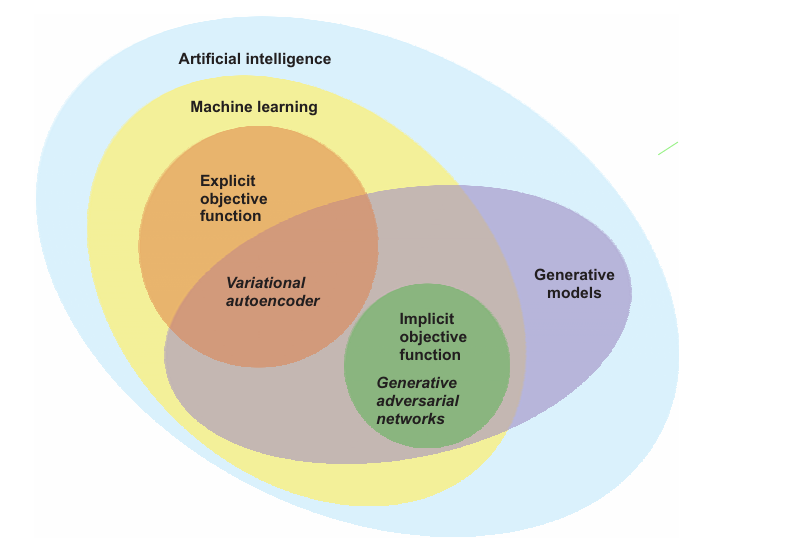
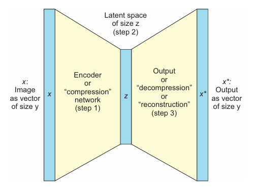

# GANs in Action

## 2 Into to Generative Modeling With Autoencoders

### 2.1 Introduction to Generative Modeling

We should be familiar with how deep learning takes raw pixels and turns them into class prediction. We can take three matrixes that contain pixels of an image (one for each color channel) and pass them through a system of transformations to get a single number at the end.

In the opposite direction, we start with a prescription of what we want to produce and get the image at the other end of the transformations. That is generative modeling. A bit more formally, we take a certain prescription (z)-for this simple case, let`s say it is a number between 0 and 9-and try to arrive at a generated samples (x*). Ideally, this x* would look as realistic as another real sample, x. **The prescription, z, lives in a latent space and serves as an inspiration so that we do not always get the same output, x***. This latent space is a learned representation-hopefully meaningful to people in ways we think of it ("disentangled"). Different models will learn a different latent representation of the same data.

The random noise is often referred to as a sample from the latent space. Latent spasce is a simpler, hidden representation of a data point. It is denoted by z, and simpler just means lower-dimensional. For example, a vector or array of 100 numbers rather than the 768 that is the dimensionality of the samples.

**In many ways, a good latent representation of a data point will allow you to group things that are similar in this space**.

### 2.2 How do autoencoders function on a high level?

Autoencoders help us encode data automatically. Autoencoders are composed of two parts: encoder and decoder. Let's consider one case: compression.

Definition: the latent space is the hidden representation of the data. Rather than expression words or images (for example, chine learning engineer in our example, or JPEG codec for imagens) in their uncompressed versions, an autoencoder compresses and clusters them based on its understanding of the data.

### 2.3 What are autoencoders to GANs?

One of the **key distinctions** with **autoencoders** is that we **end-to-end train the whole network with one loss function**, whereas **GANs have distinct loss functions for the Generator and the Discriminator**. 

GAN and autoencoder are both generative models that are subsets of AI and ML. In the case of autoencoders (or their variational alternative, VAEs), we have an explicitly written function that we are trying to optimize (a cost function); but in the case of GANs, we do not have an explicit metric as simple as mean squared error, accuracy, or are under RoC curve to optimize. GANs instead have two competing objectives that cannot be written in one function.

### 2.4 What is autoencoder made of?

1. Encoder network: we take a representation x (for example, an image) and then reduce the dimension from y to z by using a learned encoder (typically, a one- or many-layer neural network);
2. Latent space (z): as we train, here we try to establish the latent space to have some meaning. Latent space is typically a representation of a smaller dimension and acts as an intermediate step. In this representation of our data, the autoencoder is trying to "organize its thoughts";
3. Decoder network: we reconstruct the original object into the original dimension by using the decoder. This is typically done by a neural network that is a mirror image of the encoder. This is the step from z to x*. We apply the reverse process of the encoding to get back, for example, a 784 pixel-values long reconstructed vector (of a 28 x 28 image) from the 256 pixel-values long vector of the latent space.

He's an example of autoencoder training:

1. We take images x and feed them through the autoencoder;
2. We get out x*, reconstruction of the images;
3. We measure the reconstruction loss-the difference between x and x*:
   1. This is done using a distance (for example, mean average error) between the pixels of x and x*;
   2. This gives us an explicit objective function (|| x-x*||) to optimize via a version of gradient descent.

So we are trying to find the parameters of the encoder and the decoder that would minimize the reconstruction loss that we update by using gradient descent.

### 2.5 Usage of autoencoders

Despite their simplicity, there are many reasons to care about autoencoders:

1. We get compression. The intermediate step becomes an intelligently reduced image or object at the dimensionality of the latent space (z);
2. Still using the latent space, we can think practical application, such as a one-class classifier (an anomaly-detection algorithm), where we can see the items in a reduced, more quickly searchable latent space to check for similarity with the target class;
3. Antoher use case is data denoising or colorization of black-and-white images;
4. Some GANs architectures-such as BEGIN-use autoencoders as part of their architecture to help them stabilize their training, which is critically important;
5. Training those autoencoders does not require labeled data;
6. We can use autoencoders to generate new images.  Autoencoders have been applied to anything from digits to faces to bedrooms,  but usually the higher the resolution of the image, the worse the performance, as the output tends to look blurry.

**So all of these things can be done just because we found a new representation (latent space) of the  data we already had. This representation is useful because it brings out the core information, which is natively compressed, but it’s also easier to manipulate or generate new data based on the latent representation!**

### 2.6 Unsupervised learning

Definition: Unsupervised learning is a type of machine learning in which we learn from the data itself without additional labels as to what this data means. Clustering, for example, is unsupervised-because we are just trying to discover the underlying structure of the data; but anomaly detection is usually supervised, as we need human-labeled anomalies.

#### 2.6.1 New take on an old Idea

An autoencoder is composed of two neural networks: an encoder and a decoder. In our case, both have activation functions, and we will be using just one intermediate layer for each.  This means we have two weight matrices in each network-one from input to intermediate and then one from intermediate to latent. Then again, we have one from latent to different intermediate and then one from intermediate to output. If we had just one weight matrix in each, our procedure would resemble a well-established analytical technique called principal component analysis (PCA).

Some technical differences exist in how the solutions are learned—for example, PCA is **numerically deterministic**, whereas autoencoders are typically trained with a **stochastic optimizer**.

#### 2.6.2 Generation using an autoencoder

#### 2.6.3 Variational autoencoder

In the case of a variational autoencoder, we choose to represent the latent space as a distribuion with a learned mean and stardard deviation rather than just a set of numbers.

### 2.7 Code is life

[Hand-written digitas using encoder decoder](handwritten-encoder-decoder.ipynb)

