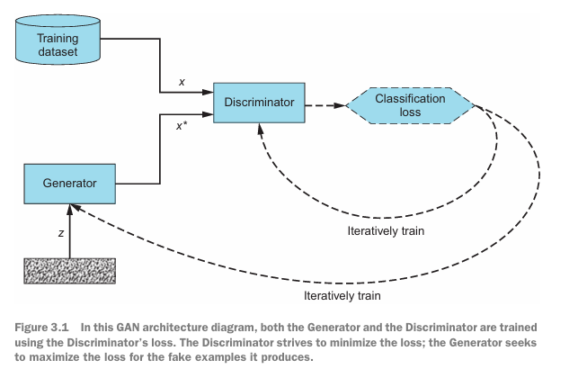
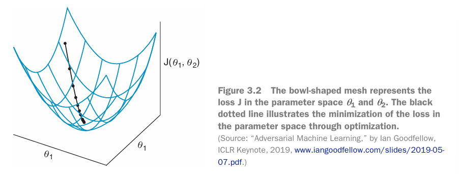
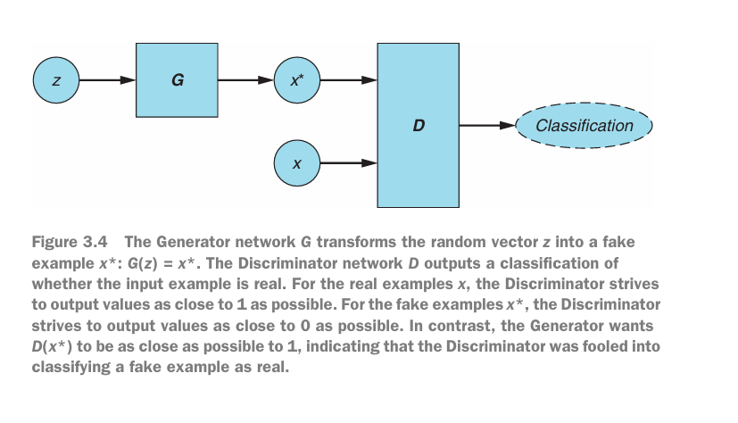
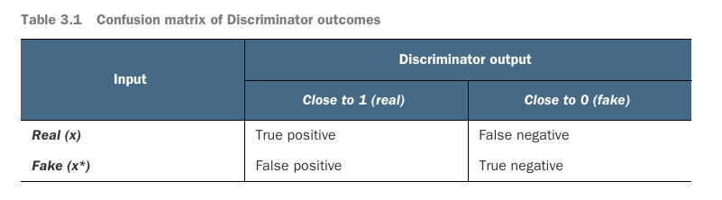
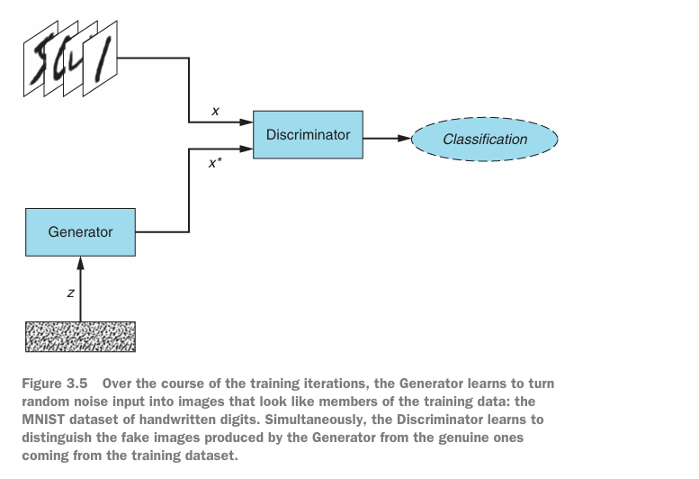

# GANs in Action

## Your first GAN:  Generating handwritten digits

### 3.1 Foundations of GANs: Adversarial training

The Generator and Discriminator are represented by differentiable functions, such as neural network, each with its own cost function. The two networks are trained by backpropagation by using Discriminator's loss.

The Discriminator strives to minimize the loss for both the real and the fake examples, while the Generator tries to maximize the Discriminator's loss for the fake examples it produces.

The training dataset determines the kind of examples the Generator will learn to emulate.

The generator's goal is to produce examples that capture the data distribution of the training dataset. Recall that to a computer, an image is just a matrix of values: two-dimensional for grayscale and three-dimensional for color images.

Object recognition models learn the patterns in images to discern an image's content. The Generator can be thought of as the reverse of the process: rather than recognizing these patterns, it learns to synthesize them.

#### 3.1.1 Cost Functions

GANs differ from conventional neural networks in two key respects. First, the cost function of a traditional neural network is defined exclusively in terms of its own trainable parameters. GANs consist of two networks whose const functions are dependent on both of the networks' parameters.

The second difference is that traditional neural network can tune all its parameters during the training process. In a GAN, each network can tune only its own weights and biases. Accordingly each network has control over only a part of what determines its loss.

#### 3.1.2 Training Process

The training of a traditional neural network is an optimization problem. We seek to minimize the cost function by finding a set of parameters such that moving to any neighboring point in the parameter space would increase the cost. This could be either a local or a global minimum in the parameter space, as determined by the cost function we are seeking to minimize.

Training GANs successfully requires trial and error, and although there are best practices, it remains as much an art as it is a science.

### 3.2 The Generator and the Discriminator

The Generator (G) takes in a random noise vector z and produces a fake example x*. Mathematically, G(z) = x*. The Discriminator (D) is presented either with a real example x or with a fake example x*; for each input, it outputs a value between 0 and 1 indicating the probability that the input is real.

#### 3.2.1 Conflicting Objectives

The Discriminator's goal is to be as accurate as possible. For the real examples x, D(x) seeks to be as close as possible to 1 (label for the positive class). For fake examples x*, D(x*) strives to be as close as possible to 0 (label for the negative class).

The Generator's goal is the opposite. It seeks to fool the Discriminator by producing fake examples x* that are indistinguishable from real data in the training dataset. Mathematically, the Generator strives to produce fake examples x* such that D(x*) is as close to 1 as possible.

#### 3.2.2 Confusion Matrix

The Discriminator's classification can be expressed in terms of a confusion matrix, a tabular representation of all possibles outcomes in binary classification.

* *True positive*: real example correctly classified as real; D(x) = 1;
* *False negative*: real example incorrectly classified as fake; D(x) = 0;
* *True negative*: fake example correctly classified as fake; D(x*) == 0;
* *False positive*: fake example incorrectly classified as real; D(x*) == 1/

The Discriminator is trying to maximize true positive and true negative classifications or, equivalently, minimize false positive and false negative classifications. In contrast, the Generator's goal is to maximize the Discriminator's false positive classifications - these are the instances in which the Generator successfully fools the Discriminator into believing a fake example is real. The Generator is not concerned with how well the Discriminator classifies the real examples; it cares only about the discriminator's classification of the fake data samples.

### 3.3 GAN training algorithm

**For** each training iteration **do**
    1. Train the Discriminator:
        a. Take a random mini-batch of real examples:x;
        b. Take a mini-batch of random noise vectors z and generate a mini-batch of fake examples: G(z) = x*;
        c. Compute the classification losses for D(x) and D(x*), and backpropagate the total error to update the Discriminator's variables to minimize the classification loss;
    2. Train the Generator?
        a. Take a mini-batch of random noise vectors z and generate a mini-batch of fake examples: G(z) = x*;
        b. Compute the classification loss for D(x*), and backpropagate the loss to update the Generator's variables to maximize the classification loss.

### 3.4 Tutorial: Generating handwritten digits

[Generating handwritten digits](handwritten-GAN.ipynb)

